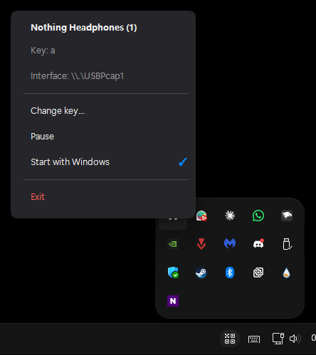

# Nothing Headphones (1) — voice assistant button remapper

Detect button presses on **Nothing Headphones (1)** in real time on Windows, and
map the **voice assistant button** to any keystroke you want.

The official Nothing X app lets you reassign the buttons to a handful of *media*
actions — but it can't turn a button press into an arbitrary keyboard key. This
tool can, which makes the voice assistant button usable for:

- Discord / TeamSpeak push-to-talk
- OBS scene or mute toggles
- Game keybinds and macros
- AutoHotkey triggers
- Accessibility shortcuts
- …anything that reacts to a key press

It works by **sniffing the Bluetooth traffic** between your PC and the
headphones.



---

## ⚠️ AI disclosure

**100% of the code in this repository was written by AI (Claude)** — along
with the Bluetooth reverse-engineering, the protocol decoding, and the
debugging.

As with **any** code — AI-written or not — review it before you run it.
It is plain-text PowerShell with no obfuscation and no network access, so it
is straightforward to audit. Use at your own risk.

---

## How it works

Nothing Headphones (1) talk to the host over **Classic Bluetooth (BR/EDR)**.
Different buttons use different standard profiles:

| Button | Protocol | What goes over the air |
|---|---|---|
| Voice assistant | HFP (Hands-Free Profile) over RFCOMM | the AT command `AT+BVRA=1` / `AT+BVRA=0` |
| Play / Pause / Next / Prev | AVRCP `PASS THROUGH` over L2CAP/AVCTP | operation IDs `0x44`, `0x4B`, `0x4C`, … |
| Volume | AVRCP `EVENT_VOLUME_CHANGED` notification | the new absolute volume (0–127) |

The tool captures the **USB traffic to your Bluetooth dongle** with
[USBPcap](https://desowin.org/usbpcap/) + [Wireshark](https://www.wireshark.org/)’s
`tshark`, then matches known byte signatures inside the L2CAP payloads:

```
Voice assistant : ...41 54 2b 42 56 52 41 3d 3X...   ("AT+BVRA=X")
AVRCP button    : ...11 0e 00 48 7c <op>...          (AVCTP + PASS THROUGH)
Volume changed  : ...11 0e 0d 48 00 00 19 58 31...   (AVRCP volume notify)
```

When a voice-assistant event is seen, it injects the configured key via the
Win32 `keybd_event` API.

> **Note on the capture pipeline:** newer `tshark` builds pass an
> `--extcap-capture-filter` argument that older `USBPcapCMD.exe` builds reject.
> The tool sidesteps this by running two `tshark` processes —
> `tshark -w -` (capture only, no dissection) piped into `tshark -r -`
> (dissection + display filter). The second process never touches extcap.

---

## Requirements

- **Windows 10 / 11**
- **A USB Bluetooth dongle.** This is required — most built-in laptop Bluetooth
  chips are not on the USB bus, so USBPcap can't see them. A cheap generic
  dongle (CSR, Realtek, etc.) works fine.
- **Nothing Headphones (1)** paired to that dongle.
- **[Wireshark](https://www.wireshark.org/download.html)** installed, with the
  **USBPcap** component checked during installation (it is checked by default).

---

## Setup

1. Install Wireshark (keep the USBPcap option checked).
2. Plug in your USB Bluetooth dongle and pair the headphones to it.
3. Download this repository (green **Code** button → **Download ZIP**, then
   extract) — or `git clone` it.

That's it. No build step.

---

## Usage

### Tray app (recommended)

Double-click **`tray.bat`** (or **`launch-hidden.vbs`** for a completely
flash-free start). A headphones icon appears in your system tray.

Click the icon for a menu:

- **Change key…** — set which key the voice-assistant button sends
- **Pause** — temporarily stop sending keystrokes
- **Start with Windows** — launch automatically at login (✓ when enabled)
- **Exit**

Your key choice is saved to `%APPDATA%\NothingHeadphonesDetector\config.json`
and restored on the next launch.

**About "Start with Windows":** capturing USB traffic requires administrator
rights, so autostart is registered as a Scheduled Task that runs elevated —
this means **no UAC prompts at boot**. Creating that task needs elevation, so
you'll see **one** UAC prompt when you enable the toggle; every boot afterwards
is silent. The task launches 30 seconds after login (once the desktop and
USBPcap driver have settled) for reliability.

### Command-line version

For debugging or a visible live log, use **`run.bat`**:

```bat
run.bat                       :: default key: F13
run.bat -Key A                :: send "A"
run.bat -Key "Ctrl+Shift+F13" :: modifier combos
run.bat -Key "Alt+M"
```

It prints every detected button event (voice, media, volume) as it happens.

### Supported keys

`F1`–`F24`, `A`–`Z`, `0`–`9`, `Space`, `Enter`, `Tab`, `Esc`, `Backspace`,
combined with modifiers `Ctrl`, `Shift`, `Alt`, `Win` using `+`.

> **Tip:** `F13`–`F24` are great defaults — Windows has them as real keys but
> almost no application uses them, so they won't clash with existing shortcuts.

---

## Behavior of the voice assistant button

The voice assistant button is a **toggle** — each physical tap flips an internal
state and sends a single event (`AT+BVRA=1`, then `=0`, then `=1`, …). The
headphones do **not** send a separate "released" event, so true push-to-talk
(hold-to-talk) isn't possible from the button alone.

This tool therefore sends **one keystroke per tap**, regardless of whether the
event was `=1` or `=0`. Tap the headphone button once → one key press.

---

## Limitations

- **USB Bluetooth dongle required** — built-in Bluetooth radios are usually
  invisible to USBPcap.
- **Verified on Nothing Headphones (1).** Other Nothing models (Ear, Ear (a),
  etc.) likely use the same AVRCP/HFP commands but the byte signatures haven't
  been confirmed.
- **Windows only.** The capture method (USBPcap) and key injection
  (`keybd_event`) are Windows-specific.
- The first launch of `run.bat` / `tray.bat` after downloading may trigger a
  SmartScreen "Windows protected your PC" prompt — click **More info → Run
  anyway** once.

---

## Troubleshooting

**"tshark.exe not found"** — install Wireshark, or pass the path explicitly:
`run.bat -Tshark "D:\path\to\tshark.exe"`.

**No events detected** — make sure the headphones are connected to the *USB
dongle* (not the built-in adapter). If you have several USB controllers, force
the interface: `run.bat -Interface "\\.\USBPcap2"`.

**Capture pipe exits immediately** — another capture (Wireshark itself, a stale
`tshark`) may be holding the interface. Close it and retry.

---

## Repository contents

| File | Purpose |
|---|---|
| `tray.ps1` | The tray application (UI, key mapping, autostart) |
| `tray.bat` | Launcher for the tray app |
| `launch-hidden.vbs` | Flash-free launcher (used by autostart; windowless start) |
| `detector.ps1` | Command-line detector (live log of every button) |
| `run.bat` | Launcher for the command-line detector |

---

## Contributing

Useful directions if you want to extend it:

- **Built-in Bluetooth support** — capture via Windows ETW instead of USBPcap.
- **Other Nothing models** — confirm the byte signatures and add them.
- **Linux / macOS ports** — the protocol is the same; the capture and
  key-injection layers would need replacing.

---

## Credits

All code written by AI (Claude) — see the **AI disclosure** section near the
top of this README. The Bluetooth protocol analysis — byte signatures, the
AVRCP/HFP command decoding, and the `tshark`/USBPcap workaround — was worked
out by capturing and decoding live traffic from real Nothing Headphones (1).

## License

[AGPL-3.0](LICENSE)
